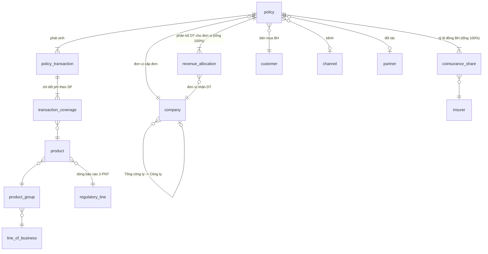

# Căn cứ thiết kế: mô hình dữ liệu POC Doanh thu bảo hiểm v2

Tài liệu này trả lời câu hỏi "**tại sao** mô hình được thiết kế như vậy" cho từng bảng, từng quy tắc và từng con số trong dữ liệu dummy.

Mọi căn cứ đều là nguồn **public**:
- luật, nghị định, thông tư (đọc trực tiếp trên vbpl.vn);
- số liệu thị trường của IAV và Bộ Tài chính;
- thông tin sản phẩm công khai của các DNBH;
- các chuẩn mô hình dữ liệu ngành bảo hiểm quốc tế.

Chi tiết nguồn nằm trong [sources/](sources/).

## 1. Nguyên tắc

1. **Khung nghiệp vụ lấy từ quy định.** Danh mục nghiệp vụ, kênh phân phối, cách ghi nhận doanh thu, đồng bảo hiểm, hoàn/giảm phí, biểu phí bắt buộc, thuế GTGT và trần hoa hồng đều lấy từ văn bản pháp luật hiện hành.
2. **Con số lấy từ số liệu công bố.** Quy mô và cơ cấu nghiệp vụ theo BCTC kiểm toán công khai của Bảo hiểm PVI; mùa vụ, kênh, mức phí, tỷ giá theo công bố của PVI, IAV, Bộ Tài chính, KBNN. Không dùng số liệu nội bộ của bất kỳ doanh nghiệp nào.
3. **Tổ chức và đối tác được ẩn danh.** Doanh nghiệp giả lập tên "Tổng công ty Bảo hiểm DEMO", tên công ty thành viên theo địa bàn. Đối tác và DN đồng bảo hiểm ghi dạng "A, B, C".
4. **Ánh xạ được về hệ thống thật.** Mỗi khái niệm trong mô hình đều có chỗ tương ứng trong một hệ thống lõi bảo hiểm thực tế. Bản ánh xạ cho giai đoạn ETL nằm ở `docs/Mapping_v2_PIAS.html` (tài liệu nội bộ dự án).

## 2. Kiến trúc



| Lớp | Bảng | Vai trò |
|---|---|---|
| `ref` | 16 bảng danh mục | Chuẩn hóa theo luật và thị trường |
| `core` | `policy`, `policy_transaction`, `transaction_coverage`, `coinsurance_share`, `revenue_allocation` | Giao dịch nghiệp vụ, kiểu "hệ thống lõi bảo hiểm" |

## 3. Căn cứ của từng bảng

### Lớp core

| Bảng | Tại sao có bảng này | Căn cứ public |
|---|---|---|
| `core.policy` | Hợp đồng là đơn vị giao kết pháp lý. Một hợp đồng có thể có nhiều giao dịch phí theo thời gian | Luật KDBH 2022 (khái niệm hợp đồng bảo hiểm); mô hình Policy trong ACORD / IBM IIW |
| `core.policy_transaction` | Doanh thu phát sinh theo **giao dịch**: cấp mới, tái tục, SĐBS, hoàn phí, hủy. Mỗi loại hạch toán vào tài khoản khác nhau | NĐ 46/2023 Điều 49 (khoản phải thu / khoản giảm thu); TT 232/2012 (TK 5111 / 5311 / 5321); Kimball "policy transaction fact" |
| `core.transaction_coverage` | Một hợp đồng có thể gồm nhiều sản phẩm, ví dụ vật chất xe kèm TNDS bắt buộc. Doanh thu phải tách theo **nghiệp vụ** | TT 232/2012 Điều 12: TK 511 chi tiết theo từng nghiệp vụ; TT 67/2023 Mẫu 2-PNT báo cáo theo nghiệp vụ |
| `core.coinsurance_share` | Đồng bảo hiểm là nhiều DNBH cùng nhận 1 hợp đồng theo tỷ lệ. Mỗi DN **chỉ ghi nhận phần phí của mình** | Luật KDBH 2022 Điều 4 khoản 29; TT 232/2012 Điều 19; TT 67/2023 Điều 41 khoản 2 |
| `core.revenue_allocation` | DN nhiều đơn vị cần gán doanh thu cho đơn vị thực sự khai thác: hợp tác giữa các đơn vị, trụ sở khai thác rủi ro lớn, kênh số chuyển doanh thu về địa bàn | Mô hình tổ chức "Tổng công ty → công ty thành viên" của các DNBH lớn (báo cáo thường niên Bảo Việt, PVI: 47–79 công ty thành viên). Đây là **thông lệ quản trị**, không phải quy định pháp lý |

### Lớp ref

| Bảng | Căn cứ public |
|---|---|
| `ref.line_of_business` | Luật KDBH 2022 Điều 7 khoản 1 (3 loại hình: nhân thọ, sức khỏe, phi nhân thọ); NĐ 46/2023 Điều 4 (11 nghiệp vụ phi nhân thọ) và Điều 5 (nghiệp vụ sức khỏe) |
| `ref.regulatory_line` | TT 67/2023 Phụ lục VI, Mẫu 1-PNT/2-PNT. Ví dụ: A.1 Sức khỏe, thân thể; A.2 Chi phí y tế; B.4a TNDS bắt buộc (mô tô / ô tô); B.4b Vật chất xe; B.5a Cháy nổ bắt buộc; B.5b Cháy nổ khác |
| `ref.product_group` | Đúng 8 nhóm sản phẩm trong đề bài, gắn với nghiệp vụ theo luật |
| `ref.product` | Tên sản phẩm theo cách gọi phổ biến trên website các DNBH. Có 3 cột căn cứ: `is_compulsory` (NĐ 67/2023), `vat_rate` (Luật GTGT 48/2024 Điều 5 khoản 8), `max_commission_pct` (TT 67/2023 Điều 51) |
| `ref.channel` | Luật KDBH 2022 Điều 87 khoản 4 (trực tiếp / qua đại lý, môi giới / đấu thầu / giao dịch điện tử). Bancassurance: Điều 125 khoản 2, NĐ 46 Điều 62, TT 67 Điều 53. Cột `report_channel_group` lấy 3 nhóm kênh của **Mẫu 3-PNT** |
| `ref.partner` | Loại đối tác theo thực tế thị trường: ngân hàng, công ty tài chính, đăng kiểm, đại lý ô tô, OTA, ví điện tử, sàn TMĐT, hãng bay, nhà mạng. PVI Annual Report 2024 nêu kênh API với hãng bay, nhà mạng, sàn TMĐT. Tên được ẩn danh |
| `ref.province`, `ref.region` | NQ 202/2025/QH15: 34 tỉnh/thành từ 01/7/2025. Chia Bắc/Trung/Nam là **đề xuất của dự án**, vì không có văn bản pháp lý nào chia 3 miền |
| `ref.fx_rate` | Tỷ giá hạch toán hằng tháng của Kho bạc Nhà nước năm 2025. Năm 2024 là ước tính |
| `ref.transaction_type` | NĐ 46/2023 Điều 49 khoản 3 (hoàn phí, giảm phí là khoản giảm thu); TT 232/2012 (TK 5111, 5311, 5321) |

## 4. Quy tắc doanh thu

```
doanh thu = transaction_coverage.premium_vnd  (phí 100% hợp đồng, VND, chưa VAT)
          × coinsurance_share.share_pct('OWN')  (phần của công ty trong đồng BH)
          × revenue_allocation.allocation_pct   (phần phân bổ cho đơn vị)
```

| Quy tắc | Căn cứ |
|---|---|
| Chỉ tính phần phí của công ty khi đồng BH | TT 232/2012 Điều 19; TT 67/2023 Điều 41 khoản 2 |
| Ghi nhận khi **phát sinh trách nhiệm bảo hiểm**. Mô hình hóa: `accounting_date` = max(ngày cấp, ngày bắt đầu hiệu lực). Vì vậy hợp đồng cấp tháng 12/2025 có hiệu lực tháng 01/2026 sẽ ghi nhận doanh thu năm 2026 | TT 67/2023 Điều 41 khoản 1 (đã sửa bởi TT 96/2026); TK 005 "hợp đồng chưa phát sinh trách nhiệm" trong TT 232/2012 |
| Hoàn phí, giảm phí, hủy đơn mang số âm, cộng vào kỳ phát sinh | NĐ 46/2023 Điều 49 khoản 3; TT 232/2012 (TK 531, 532) |
| Doanh thu tính chưa VAT | Luật GTGT 48/2024 |
| Chỉ tính chứng từ `APPROVED` | Kiểm soát nội bộ (giả định POC) |

## 5. Hiệu chỉnh dữ liệu dummy

Chi tiết từng bước nằm ở [GENERATION_LOGIC.md](GENERATION_LOGIC.md). Bảng dưới là tóm tắt.

| Tham số | Giá trị | Nguồn |
|---|---|---|
| Quy mô và cơ cấu doanh thu | 2025: 10.378 tỷ trong phạm vi POC. Sức khỏe & tai nạn 3.213, xe 1.823, cháy nổ 3.451, tài sản ≈ 1.891 | BCTC kiểm toán 2025 của Bảo hiểm PVI, thuyết minh 21 (phí gốc theo nghiệp vụ) |
| Phần tài sản thuần trong "Tài sản & thiệt hại" | 50% | **Ước tính** (BCTC gộp kỹ thuật, năng lượng) |
| Trong Con người | Sức khỏe 75% / Sinh mạng–tai nạn 15% / Du lịch 5% / Học sinh 5% | **Ước tính** (FPTS: sức khỏe PVI chủ yếu là nhóm doanh nghiệp) |
| Trong Xe | TNDS bắt buộc 24% / Vật chất xe 76% | IAV 2024 (4.537 / 18.693 tỷ) |
| Mùa vụ | Theo quý: 29,7 / 24,1 / 24,8 / 21,4%; học sinh đỉnh tháng 8–10 | Phí gốc theo quý PVI 2025; báo chí |
| Kênh điện tử | ≈ 6% (2024) → ≈ 10% (2025) | BCTN PVI 2024, 2025 |
| Môi giới / bancassurance | ≈ 15–20% / ≈ 5–8% | **Ước tính** (thị trường: môi giới 13,5%) |
| Phí TNDS bắt buộc | 437.000 / 794.000 / 756.000 / 853.000 … (ô tô); 55.000 / 60.000 (mô tô) | NĐ 67/2023 Phụ lục I |
| Tỷ lệ phí cháy nổ bắt buộc | 0,05–0,5% theo nhóm cơ sở | NĐ 67/2023 Phụ lục II (bản 2023) |
| Vật chất xe ô tô | 1,1–2,0% giá trị xe | Trong khoảng công bố 0,5–3,5% của DNBH |
| Học sinh | 100–150 nghìn đ/em (tai nạn) | Báo chí: mức phổ biến 100.000 đ |
| Sức khỏe cá nhân | từ 1,45 triệu đ | Phí niêm yết trên website các DNBH |
| Du lịch | từ 17 nghìn đ (trong nước); 4–45 USD (quốc tế) | Phí niêm yết trên website các DNBH |
| Hoa hồng | ≤ trần theo nghiệp vụ; bằng 0 với bán trực tiếp và đấu thầu | TT 67/2023 Điều 51 |

## 6. Hỏi đáp "Tại sao…"

**Tại sao mô hình này nhìn giống hệ thống của chúng tôi?**

Mọi DNBH phi nhân thọ tại Việt Nam đều phải đáp ứng cùng một bộ quy định:
- hợp đồng và SĐBS;
- đồng bảo hiểm chỉ ghi nhận phần của mình (TT 232 Điều 19);
- hoàn/giảm phí là khoản giảm thu (NĐ 46 Điều 49);
- báo cáo theo nghiệp vụ và theo kênh (TT 67 Mẫu 2-PNT, 3-PNT);
- biểu phí bắt buộc (NĐ 67);
- mô hình Tổng công ty → công ty thành viên.

Các chuẩn mô hình dữ liệu ngành (IBM IIW, ACORD, Kimball) cũng dùng đúng cấu trúc hợp đồng → giao dịch → coverage. Vì vậy hệ thống của các DNBH thường giống nhau về bản chất.

Dữ liệu dummy **không** chứa số liệu, khách hàng, đối tác hay mã nội bộ của Quý công ty.

**Mô hình có theo chuẩn quốc tế không?**

Có. Cấu trúc hợp đồng → giao dịch → coverage → phần tham gia của DNBH trùng với nhiều chuẩn:
- Microsoft Common Data Model P&C (Policy, **PolicyTransaction**, Coverage, Insurer, Agency);
- OMG P&C Data Model (Policy, **Policy Coverage Detail**, Policy Amount);
- IBM IIW (Agreement, Financial Transaction, Party role);
- ACORD P&C (Coverage `NetChangeAmt`).

Hai cột đối chiếu quốc tế được thêm vào danh mục:
- loại giao dịch mang mã ACORD (NBS / RWL / PCH / XLC);
- sản phẩm mang mã Solvency II LoB.

Chi tiết xem [sources/international_standards.md](sources/international_standards.md).

**Tại sao doanh thu nhỏ hơn tổng phí ghi trên hợp đồng?**

Với đơn đồng bảo hiểm, công ty chỉ ghi nhận phần tỷ lệ của mình (TT 232 Điều 19). Tỷ lệ này nằm ở `core.coinsurance_share`, dòng `insurer_code = 'OWN'`.

**Tại sao doanh thu của Công ty X khác tổng phí các đơn X cấp?**

Doanh thu được gán theo **đơn vị được phân bổ** chứ không theo đơn vị cấp đơn. Có 3 trường hợp:
- hợp tác khai thác giữa các đơn vị;
- Khối Trụ sở khai thác rủi ro lớn cùng công ty thành viên;
- Trung tâm Kinh doanh số chuyển doanh thu về công ty quản lý khách hàng.

Tỷ lệ phân bổ nằm ở `core.revenue_allocation`, loại phân bổ ở `allocation_type_code`.

**"Doanh thu Tổng công ty" là gì?**

Mô hình hỗ trợ cả 2 nghĩa:
- (a) doanh thu hợp nhất toàn hệ thống;
- (b) doanh thu do Khối Trụ sở trực tiếp khai thác (`company_type = HEAD_OFFICE`).

Dữ liệu nguồn hỗ trợ cả hai nghĩa. Cần khách hàng chốt nghĩa nào.

**Tại sao cháy nổ xếp vào "Tài sản"?**

Đề bài gộp như vậy (nhóm POC). Theo quy định, cháy nổ là nghiệp vụ riêng (NĐ 46 Điều 4; dòng B.5 trong Mẫu 2-PNT). Mô hình giữ **cả hai** cách phân loại: `poc_group` để phân tích, `report_line_code` để đối chiếu báo cáo Bộ Tài chính.

**Tại sao học sinh, du lịch, sinh mạng nằm trong "Con người"?**

Tất cả thuộc loại hình **bảo hiểm sức khỏe** theo Luật KDBH 2022 Điều 4 khoản 15 (thương tật, tai nạn, ốm đau, chăm sóc sức khỏe) và NĐ 46 Điều 5. Đây cũng là nhóm không chịu thuế GTGT (Luật GTGT 48/2024 Điều 5 khoản 8).

**Tại sao phí TNDS là 437.000 hay 60.000?**

Đó là biểu phí bắt buộc, chưa VAT, tại NĐ 67/2023 Phụ lục I.

**Tại sao có doanh thu tháng 01/2026 trong khi dữ liệu chỉ đến 2025?**

Hợp đồng cấp cuối tháng 12/2025 nhưng bắt đầu hiệu lực tháng 01/2026. Doanh thu ghi nhận khi phát sinh trách nhiệm bảo hiểm (TT 67 Điều 41).

**Tại sao doanh thu tháng khác với tổng phí các đơn cấp trong tháng?**

Hai số này dùng hai ngày khác nhau:
- doanh thu tính theo ngày phát sinh trách nhiệm (`core.policy_transaction.accounting_date`);
- phí khai thác tính theo ngày chứng từ (`core.policy_transaction.txn_date`).

**Tại sao có khách hàng "Khách lẻ theo bảng kê"?**

Đơn TNDS, du lịch bán theo lô giấy chứng nhận qua đối tác (đăng kiểm, OTA…) thường ghi bên mua là khách lẻ gộp. Cờ `is_aggregated_retail` giúp loại nhóm này khi phân tích khách hàng định danh.

**Tại sao có 7 kênh nhưng báo cáo chỉ có 3 nhóm?**

- 7 kênh theo hình thức phân phối ở Luật KDBH Điều 87 khoản 4, tách chi tiết đại lý cá nhân / tổ chức / TCTD.
- 3 nhóm là nhóm kênh bắt buộc của Mẫu 3-PNT (TT 67): qua TCTD / qua môi trường mạng / khác.

**Tại sao quý 1 cao nhất, quý 4 thấp nhất?**

Theo phí gốc hợp nhất công bố của PVI năm 2025, các quý chiếm 29,7 / 24,1 / 24,8 / 21,4%. Nguyên nhân là các chương trình bảo hiểm doanh nghiệp (sức khỏe nhóm, tài sản, cháy nổ) tái tục đầu năm. Riêng học sinh tập trung đầu năm học.

**Tại sao cháy nổ chiếm khoảng 1/3 doanh thu, còn xe chỉ khoảng 18%?**

Cơ cấu này lấy theo BCTC kiểm toán 2025 công khai của Bảo hiểm PVI: cháy nổ 3.451 tỷ, sức khỏe & tai nạn 3.213 tỷ, xe 1.823 tỷ. Đó là đặc thù của doanh nghiệp thiên về khách hàng công nghiệp. Bình quân thị trường thì xe chiếm khoảng 24%. Chi tiết xem [GENERATION_LOGIC.md](GENERATION_LOGIC.md).

**Tại sao hoàn phí và giảm phí là số âm và có tài khoản riêng?**

Đây là khoản giảm thu (NĐ 46 Điều 49 khoản 3), hạch toán vào TK 5311 / 5321 (TT 232/2012).

**Tại sao dùng 34 tỉnh cho cả dữ liệu 2024?**

Báo cáo dùng đơn vị hành chính **hiện hành** (NQ 202/2025) để so sánh được giữa các năm.

## 7. Giả định và điểm chưa kiểm chứng

- **Tỷ lệ phí cháy nổ bắt buộc:** dùng bản 2023 (NĐ 67 Phụ lục II). Từ 01/7/2025 đã thay bằng NĐ 105/2025 Phụ lục VI, nhưng bản này chỉ có PDF scan nên chưa đối chiếu được.
- **Tỷ giá 2024 và cơ cấu nhóm "Con người":** là ước tính.
- **Chưa mô hình hóa:**
  - thu phí nhiều kỳ (TT 67 Điều 41 khoản 1 điểm d);
  - leading fee (phí quản lý của DN đứng đầu đồng BH);
  - nhận và nhượng tái bảo hiểm (ngoài phạm vi doanh thu phí gốc).
- **Ánh xạ Solvency II cho tai nạn/sinh mạng và du lịch** là suy luận theo bản chất rủi ro.
- **Chia Bắc / Trung / Nam:** là đề xuất của dự án.
- **`accounting_date`:** giả định phí đã đóng đủ hoặc có thỏa thuận nợ phí.
